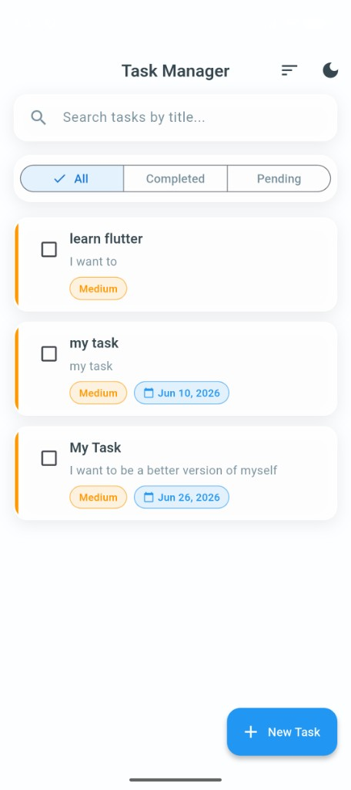
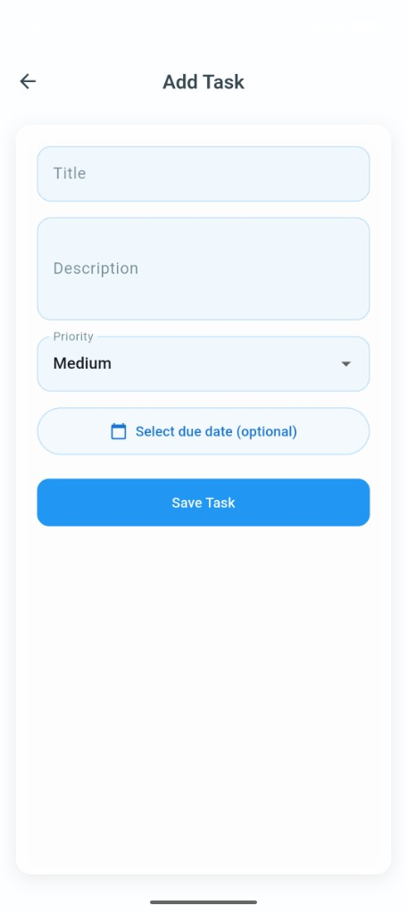
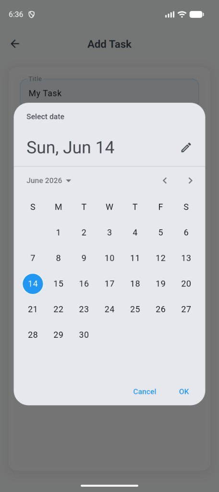

# Offline First Task Manager

A Flutter mobile application for managing tasks with full offline support. Tasks are stored locally on the device using Hive, so data persists between app launches without any network connection.

**Repository:** [github.com/shagun101pareek/task_manager_flutter](https://github.com/shagun101pareek/task_manager_flutter)

## Screenshots

| Task list | Add task |
| :---: | :---: |
| Search, filter tabs, priority colors, and due dates | Form with validation, priority picker, and optional due date |
|  |  |

| Due date picker |
| :---: |
| Material date picker when scheduling a task |
|  |

## Features

### Core (Assignment Requirements)

* Create, edit, delete, and view tasks
* Mark tasks as completed
* Task fields: title (required), description, due date, priority (Low / Medium / High)
* Offline persistence with Hive (JSON maps, no TypeAdapters)
* Task filtering: All, Completed, Pending
* Form validation (title required)
* Card-based task list UI with priority color indicators
* Loading, empty, and error states
* Subtle animations (AnimatedSwitcher + list item fade-in)
* Clean architecture with Provider state management

### Bonus Features

* Search tasks by title
* Sort by priority or due date
* Swipe to delete with undo (SnackBar)
* Dark mode support
* Local notifications for due tasks

## Tech Stack

| Technology | Purpose |
|---|---|
| Flutter | Cross-platform UI framework |
| Dart | Programming language |
| Provider | State management (`ChangeNotifier`) |
| Hive | Local key-value offline storage |
| flutter_local_notifications | Due-date reminders |

## Project Structure

```
lib/
├── data/
│   └── repositories/       # TaskRepositoryImpl (Hive-backed)
├── domain/
│   ├── entities/           # Task model + toMap/fromMap
│   ├── enums/              # TaskFilter, TaskSort
│   └── repositories/       # TaskRepository interface
├── presentation/
│   ├── providers/          # TaskProvider, ThemeProvider
│   ├── screens/            # TaskListScreen, AddTaskScreen
│   ├── theme/              # AppColors, AppTheme
│   └── widgets/            # TaskCard, TaskFilterBar, etc.
├── services/
│   ├── hive_service.dart   # Low-level Hive read/write
│   ├── notification_service.dart
│   └── preferences_service.dart
└── main.dart
```

## Setup Instructions

### Prerequisites

* [Flutter SDK](https://docs.flutter.dev/get-started/install) 3.x or later
* Android Studio / VS Code with Flutter extension
* An Android emulator, iOS simulator, or physical device

### 1. Clone the repository

```bash
git clone https://github.com/shagun101pareek/task_manager_flutter.git
cd task_manager_flutter
```

### 2. Install dependencies

```bash
flutter pub get
```

### 3. Run the app locally

```bash
# List available devices
flutter devices

# Run on connected device or emulator
flutter run
```

### 4. Run tests (optional)

```bash
flutter test
flutter analyze
```

## Build & Install (Android)

### Build a debug APK (quick testing)

```bash
flutter build apk --debug
```

Output: `build/app/outputs/flutter-apk/app-debug.apk`

### Build a release APK (submission / sharing)

```bash
flutter build apk --release
```

Output: `build/app/outputs/flutter-apk/app-release.apk`

### Install APK on a physical Android device

**Option A — via USB (ADB):**

```bash
# Enable Developer Options + USB Debugging on your phone
adb devices                          # verify device is connected
adb install build/app/outputs/flutter-apk/app-release.apk
```

**Option B — manual install:**

1. Copy `app-release.apk` to your phone (email, Google Drive, etc.)
2. Open the file on your phone
3. Allow "Install from unknown sources" if prompted
4. Tap Install

## Architectural Decisions

* **Provider + ChangeNotifier** — Simple, readable state management appropriate for this app scope.
* **Clean architecture layers** — `domain` (entities/contracts), `data` (repository impl), `services` (Hive/notifications), `presentation` (UI + providers).
* **Repository pattern** — UI never talks to Hive directly; `TaskProvider` → `TaskRepository` → `HiveService`.
* **JSON map storage** — Tasks serialized via `toMap()` / `fromMap()` without Hive TypeAdapters or code generation.
* **Full-list save** — All tasks saved as one list on each change; simple and reliable for small datasets.
* **Reusable widgets** — `TaskCard`, `TaskFilterBar`, `EmptyTasksView`, `BlurredBackground` keep screens clean.
* **Single Add/Edit screen** — `AddTaskScreen(taskId: ...)` handles both create and edit modes.

## Assumptions & Trade-offs

* No backend, authentication, or cloud sync (per assignment scope).
* Task IDs generated from timestamps — sufficient for local-only use.
* Priority stored as strings (`"Low"`, `"Medium"`, `"High"`) for simple JSON serialization.
* Notifications scheduled at 9:00 AM on the due date; skipped for past dates and completed tasks.
* Bonus features included but not required for core assignment evaluation.

## Future Improvements

* Task categories or tags
* Recurring tasks
* Cloud sync and backup
